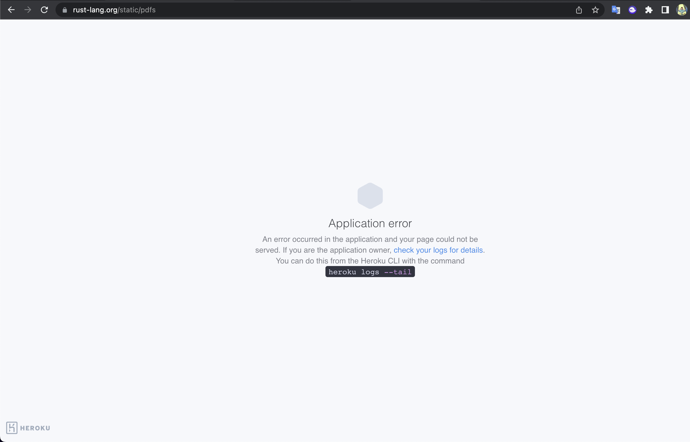

# Rust in action code examples

- My source code follow [Rust in action](https://www.amazon.com/Rust-Action-TS-McNamara/dp/1617294551/ref=sr_1_1?keywords=rust+in+action&link_code=qs&qid=1671208706&sr=8-1)

- Hopefully I do it well :D

## Some note ?
- Strings in Rust are able to include a wide range of characters

- Sometime we got errors like: `E0373` we can use command to see more detail: `rustc --explain E0373`

- Rust doesn't protect you from logical errors. It ensure that your data is never able to be written in two places at the same time. It does not ensure that your program is free from all security issues.

- [Rust at npm](https://www.rust-lang.org/static/pdfs/Rust-npm-Whitepaper.pdf) :D

- Fun fact current (12/2022) rust-lang.org hosted on heroku :D

- 

- Dont push ';' at the end of expression if you want return it's result and without `return` keyword. This changes the semantics, returning () (unit) rather than i32. See `c2-first-steps` to understand.

- It's safest to cast the smaller type to a larger one. Use cast with caution: 300_i32 as i8 will return 44.

- The three form of `for` each map to difference method:

  | Shorthand | Equivalent to | Access |
  | ---       | ---           | ---    |
  | for item in collection | for item in IntoIterator::into_iter(collection) | Ownership |
  | for item in &collection | for item in collection.iter() | Read-Only |
  | for item in &mut collection | for item in collection.iter_mut() | Read-Write |

